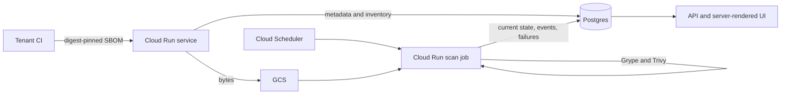

# DevRadar Development

Engineering reference for DevRadar. This document records durable decisions and
invariants; it does not duplicate implementation details.

Sources of truth, in order:

1. Code under `pkg/` and `cmd/`.
2. `pkg/server/static/openapi.yaml` for the HTTP API.
3. `pkg/data/postgres/sql/migrations/` for the database schema.
4. `.settings.yaml` for Go, scanner, build-tool, and quality-gate versions.
5. This document for intent and constraints.

`README.md` covers the product and local use. `DEPLOYMENT.md` is the operator
runbook. `ROADMAP.md` contains only unshipped work.

## Product Boundary

DevRadar continuously evaluates submitted container SBOMs. It does not pull
images, hold registry credentials, inspect running workloads, or infer runtime
reachability.

The boundary is deliberate:

- The tenant's CI sends an immutable, digest-pinned SBOM.
- DevRadar keeps package inventory fixed and refreshes vulnerability knowledge.
- Private images work without granting registry access.
- Findings describe submitted evidence, not universal image safety.

Authenticity is optional. A verified sigstore/cosign attestation proves the
configured signature, identity, predicate, and subject binding checks passed. It
does not prove that the image is safe, deployed, reachable, or compatible.

## Architecture



There are two deployable units:

- `devradar-serve`: ingest, API, browser UI, authentication, and admin console.
- `devradar-scan`: scheduled canonicalization, vulnerability matching,
  enrichment, alert evaluation, posture snapshots, and housekeeping.

Both use the shared `thingz` PostgreSQL database. Every DevRadar-owned database
object is prefixed `devradar_`. SBOM bytes live in the DevRadar GCS bucket.

## Core Invariants

### Evidence identity

- An SBOM must resolve to an immutable `sha256:` image digest. Reject it when no
  digest exists in the document or digest-pinned `image_ref` override.
- SBOM identity is tenant-scoped content addressing:
  `sha256(tenant_id + raw_bytes)`.
- Stored SBOM evidence is immutable. Archiving removes it from active monitoring
  but retains findings and history.
- Finding identity is `sha256(exposure/package/version)`. Scanner agreement is
  metadata; it must not double-count an exposure.

### Reproducibility and causality

A result is determined by four recorded axes:

| Axis | Example | Event cause |
|---|---|---|
| SBOM inventory | image digest and SBOM ID | `image` |
| Vulnerability database | Grype/Trivy DB version | `db` |
| Scanner matcher | pinned scanner binary | `tooling` |
| Canonicalizer | pinned Syft version | `tooling` |

Tooling changes remain in the audit trail but do not generate tenant alerts.
Only `image`- and `db`-caused events are actionable.

### State and history

- `devradar_finding` is bounded current state.
- `devradar_finding_event` is append-only change history, partitioned monthly.
- `devradar_scan_run` records proof of each scanner result and its version axes.
- `ApplyScan` serializes and commits one `(SBOM, scanner)` result atomically.
- The alert event queue is written transactionally with finding events. Alert
  evaluation happens afterward and can fail without rolling back scans.

Do not replace this with daily finding snapshots. For a fixed inventory, most
rows would be duplicates; events retain the useful change while current state
keeps reads cheap.

## Ingest Path

Treat every SBOM and attestation as attacker-controlled.

1. Authenticate the tenant with a hashed `dr_` bearer token.
2. Bound the request, base64 decode, and gzip expansion to 20 MiB of SBOM data.
3. Validate CycloneDX or SPDX JSON and resolve the subject digest.
4. Persist the object before activating the database row. Retries converge on
   the same content-addressed identity.
5. Capture package/license inventory once. Extraction failure is visible but
   does not reject an otherwise valid SBOM.
6. Verify an optional attestation and retain the evidence. Verification failure
   never blocks ingest or mutates findings.

License IDs and expressions are stored raw. SPDX parsing, taxonomy, and tenant
policy evaluation are Go read-time overlays, so policy changes do not rewrite
frozen evidence. Malformed expressions remain visible as unknown rather than
being converted into a synthetic violation.

## Scan Path

Cloud Scheduler starts the job about every 15 minutes: 96 possible ticks/day.
Work selection and scan freshness are separate:

- A new SBOM is normally picked up on the next tick.
- Freshness is tracked per `(SBOM, scanner)`.
- The default staleness window is 12 hours, so a healthy pair runs at most about
  twice/day.
- The job first performs a cheap name-only work query. With no due SBOMs it
  skips both scanner DB refreshes.
- With work present, each scanner refreshes its local DB only when missing or
  older than 24 hours. The DB is then frozen for the complete run.

Scanner databases are local to the ephemeral job instance; they are not cached
in GCS. The work-first check removes idle downloads without introducing a cache
protocol. Add shared caching only if provider limits or measured transfer/startup
cost justify the added invalidation and integrity work.

SPDX is canonicalized to CycloneDX before matching. This is an evidence-backed
compatibility decision: a 12-fixture spike showed Trivy returning no findings on
Syft SPDX inputs while conversion restored matching. Keep canonicalization in
the scan job so ingest remains fast and original evidence remains intact.

Grype, Trivy, and Syft run as pinned subprocesses. This avoids dependency
collisions, isolates scanner faults, and keeps scanner versions auditable. Each
untrusted subprocess has a default 10-minute deadline. Scanner reports are
bounded to 256 MiB during execution and before parsing.

Failures are isolated:

- One scanner failure does not block the other scanner.
- One malformed SBOM does not stop the batch.
- Per-`(SBOM, scanner)` exponential backoff and quarantine prevent 15-minute
  retry storms.
- Every failure is persisted in `devradar_scan_failure` and structured logs.
- Zero findings on a non-trivial SBOM is recorded as an anomaly but still
  persisted; a clean result is valid evidence.

EPSS and CISA KEV are best-effort overlays refreshed no more frequently than the
configured interval (20 hours by default). A KEV feed failure preserves prior
positive flags. Alert evaluation, posture snapshots, and expired-auth cleanup
still run on idle ticks, each with its own cadence or bounded workload.

## Consistency and Failure Semantics

- Idempotency is mandatory because Cloud Run Jobs retry. Replaying the same
  scan version must create no duplicate events or alerts.
- Partial failure is normal. Record and isolate it; reserve whole-run failure for
  conditions that make useful progress impossible.
- Time is metadata, not ordering truth. Database keys and explicit cursors order
  events; wall-clock timestamps do not establish causality.
- Network calls use deadlines, bounded reads, and backoff with jitter where
  retries are appropriate.
- Read-time overlays—VEX, enrichment, severity thresholds, and license policy—do
  not mutate scanner facts.
- Latest VEX state wins. Digest-scoped statements take precedence over the
  intentionally soft repository-basename match.

## Tenancy, Authentication, and Security

Tenant isolation is application-enforced, not PostgreSQL RLS:

- All SQL lives in `pkg/data/postgres`.
- Tenant-scoped methods take `tenantID` first and filter explicitly.
- Cross-tenant integration tests are required for each scoped table/query.
- Deliberate cross-tenant operator queries are `Admin`-prefixed and colocated.

Raw API tokens are never stored: credential rows retain only SHA-256 hashes and
the one-time token-display flash retains only AES-GCM ciphertext. Production must
provide `DEVRADAR_TOKEN_FLASH_KEY`; development uses a process-ephemeral key,
so a restart may discard an unread two-minute flash.
Browser access uses hashed, expiring sessions after a magic link or optional
GitHub OAuth. Mutating browser routes require CSRF protection.

Production must require the complete Grype/Trivy/Syft toolchain. Missing tools
are coverage loss, not graceful degradation. Service and scan identities are
currently broader than the target least-privilege model; closing that gap is a
production prerequisite in `ROADMAP.md`.

## API and UI Evolution

- Change handlers and `pkg/server/static/openapi.yaml` together. Do not maintain
  a second endpoint catalog in Markdown.
- Keep stdlib `net/http`, explicit middleware, bounded bodies, and uniform JSON
  errors.
- Use keyset pagination for unbounded lists. Exact totals require a separate
  measured need; do not compromise stable paging by default.
- Repositories contain slashes and therefore travel as query parameters.
- Severity and VEX behavior must be consistent across detail and aggregate
  reads. Unknown severity remains visible.
- The UI is server-rendered with `html/template` and embedded assets. Prefer
  semantic HTML and small server-generated SVG over a client framework.
- Optional Claude output must remain outside deterministic scan, policy, alert,
  and attestation decisions.

## Database and Schema Evolution

The current implementation applies numbered, embedded migrations at startup
under a PostgreSQL advisory lock. Migrations are forward-only and transactional
where PostgreSQL permits.

For every schema change:

- Use expand/contract semantics compatible with the previous application
  revision.
- Add migration and tenant-isolation integration coverage.
- Rehearse against an isolated restore of production data.
- Measure production-shaped query plans before adding speculative indexes.
- Never edit an applied migration; add the next numbered file.

Moving DDL to a dedicated migrator identity is a production prerequisite. Until
then, startup remains migration-capable and runtime DB credentials require DDL.

## Operations and Validation

The service emits structured `slog` JSON. Cloud Run and Cloud Monitoring provide
request rate, errors, latency, resource saturation, and job execution signals.
Domain failures live in PostgreSQL so scanner gaps and evaluator backlog remain
queryable. Service-specific alarms and SLOs remain a production prerequisite.

Local and CI validation use the same pinned versions from `.settings.yaml`:

```text
make test-unit   # race-enabled tests without PostgreSQL
make test        # race-enabled unit and integration tests
make qualify     # coverage, vet, lint, and tests
make tf-validate # Terraform validation without backend credentials
go build ./...   # direct compilation check
```

Local invitation delivery is intentionally interactive. `make deliver` writes
the full invitation link only to its controlling `/dev/tty`; redirected or
noninteractive execution fails closed. Structured logs never contain the
invitation bearer.

Before release, `make qualify`, `go build ./...`, migration rehearsal, and owner
workflow validation must pass. Do not deploy, tag, push, run `terraform apply`,
or expose a production feature without explicit owner approval.
